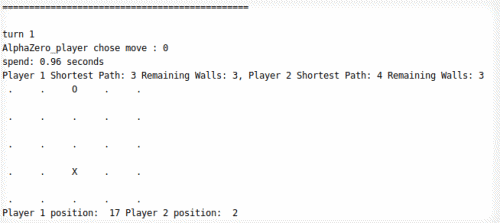

#### Jay Lee

 

Seoul. Korea. Data Science Cell, Hana Institute of Technology.

Studied ML/DL/RL in Theory of Computation Lab, Kangwon National University(Bachelor's degree)

 

  [Github](https://github.com/Clarit7) &nbsp; &nbsp; [Blog](https://clarit7.github.io) &nbsp; &nbsp; [Email](mailto:intelleej@gmail.com) &nbsp; &nbsp; [Lab](https://narame7.github.io/) &nbsp; &nbsp; [DockerHub](https://hub.docker.com/u/clarit7)

 

***

## Career

* **2022.07 ~ 현재** : 하나금융융합기술원 Data Science셀 연구원
* **2021.07 ~ 2022.07** : 하나은행 ICT리빌드 본부 AI Unit
* **2019.12 ~ 2021.07** : 강원대학교 계산이론 연구실 학부연구생
* **2019.03 ~ 2021.08** : 강원대학교 컴퓨터정보통신공학과 전과, 학사 졸업
* **2015.03 ~ 2016.08** : 강원대학교 화학공학과 학부 입학

 

***

## Award

 
  
* **Naver AI RUSH 2020 (2020.08)**
  
  [Link](https://campaign.naver.com/airush/)
  
  Anomaly detection in time series data - 1st
  
  Spam mail classification - 3rd

 

* **한국정보과학회 학부생/주니어 부문 (2020.08)**

  AlphaQuoridor: AlphaZero 알고리즘 기반 쿼리도 게임 에이전트 구현 - 장려상

 

* **제 27회 한국정보올림피아드 (2010.06/08)**

  강원도대회 - 금상
  
  전국대회 - 동상

 

***

## Research

 

* **Modular Reinforcement Learning for Playing the Game of Tron**

  Mingi Jeon*, Jay Lee, Sang-Ki Ko
  
  IEEE Access 2022

  [Paper](https://ieeexplore.ieee.org/document/9775163)

 

* **AlphaQuoridor: AlphaZero 알고리즘 기반 쿼리도 게임 에이전트 구현**

  Jay Lee*, Sang-Ki Ko

  KCC2020

  

  [Github](https://github.com/Clarit7/AlphaZero_Quoridor) &nbsp; &nbsp; [Paper](https://www.dbpia.co.kr/Journal/articleDetail?nodeId=NODE09874821)

 

***

## Experiece

 

* [**SW중심대학 공동해커톤**](https://swhackathon.com/)

  
  
  Team EnMem. 사진-음악 매칭 웹앱 제작 - React js developer (FE, API)
  
  [Youtube](https://youtu.be/L_te34S3Zec)
  
 

* **교내 산학협력 프로젝트**
  
  
  
  bunnfit 앱 타이머 모듈 및 운동추천 웹앱 제작 - Team Leader, React js developer

  [Android](https://play.google.com/store/apps/details?id=com.bunnit.haja.android) &nbsp; &nbsp; [iOS](https://apps.apple.com/kr/app/%EB%B2%88%ED%95%8F-%EA%B8%B0%EB%A1%9D%EC%9D%B4-%EB%AA%B8%EC%9D%84-%EB%A7%8C%EB%93%A0%EB%8B%A4/id1503464984) &nbsp; &nbsp; [Webapp](https://poll.haja.life/) &nbsp; &nbsp; [Interview](https://swuniv.kr/540522002/?q=YToxOntzOjEyOiJrZXl3b3JkX3R5cGUiO3M6MzoiYWxsIjt9&bmode=view&idx=7381249&t=board)
  
 

***

## Contribution

 

* **RLCard: A Toolkit for Reinforcement Learning in Card Games**
  
  [Github](https://github.com/datamllab/rlcard)
  
  Implemented Blackjack, Limit Hold'em human interface, and different number of players in Blackjack

 

***

## Tech

 

             
